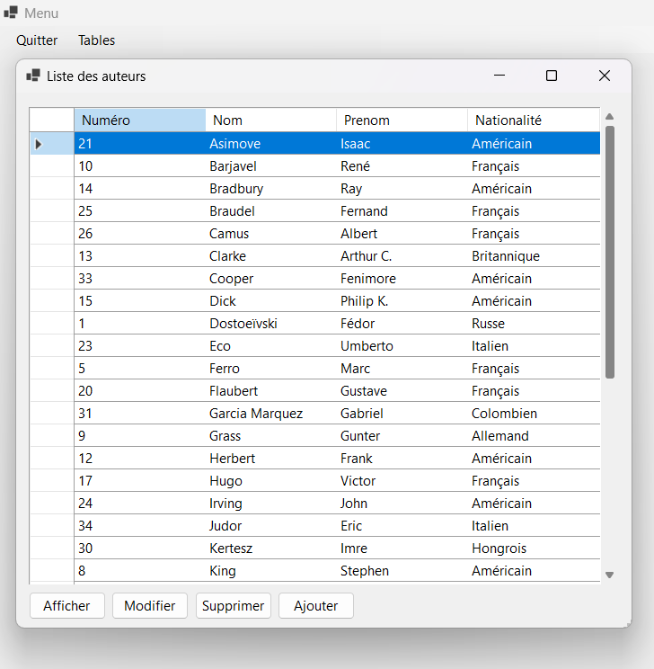
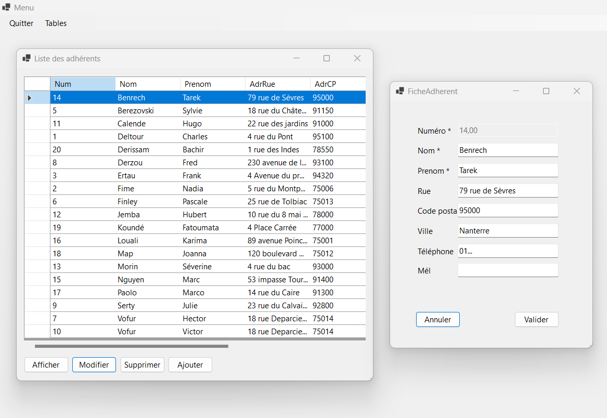
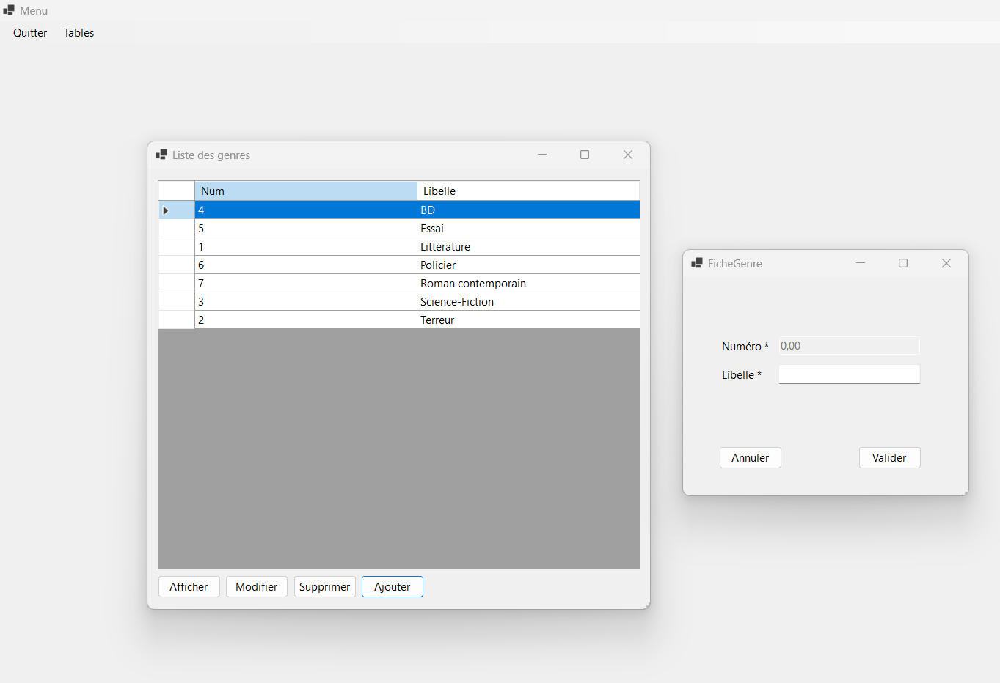
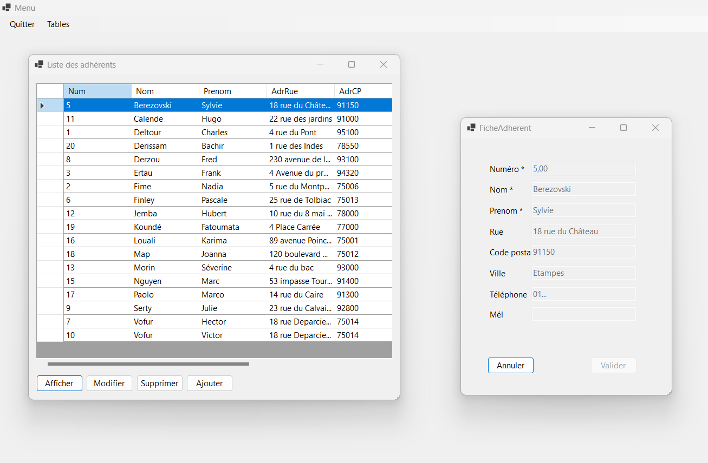

# TP Bibliothèque
Dans ce projet réalisé en C# avec ADO.NET, j'ai développé une bibliothèque qui offre des fonctionnalités CRUD 
(Create, Read, Update, Delete) pour interagir avec une base de données. 

## Présentation du Projet

 
Cette bibliothèque permet aux utilisateurs d'effectuer des opérations basiques sur des données stockées dans une base de données relationnelle.
Grâce à l'utilisation d'ADO.NET, la bibliothèque offre une solution robuste et efficace pour la manipulation de données, 
en fournissant des méthodes pour insérer de nouvelles données, lire des enregistrements existants, les mettre à jour et les supprimer.
 

 
Le CRUD Library offre une interface conviviale pour les développeurs, facilitant ainsi l'intégration dans divers projets. 
 

 
Les utilisateurs peuvent facilement importer la bibliothèque dans leurs projets C# et commencer à utiliser ses fonctionnalités immédiatement.
Ce projet a été conçu avec la modularité à l'esprit, permettant aux développeurs d'adapter la bibliothèque à leurs besoins spécifiques et de l'intégrer harmonieusement dans leurs applications existantes.
 

